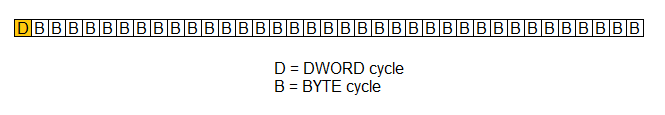
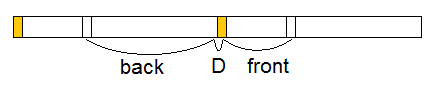
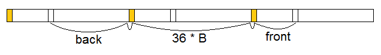
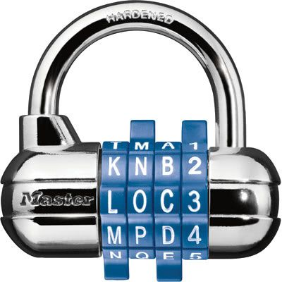
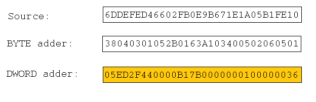
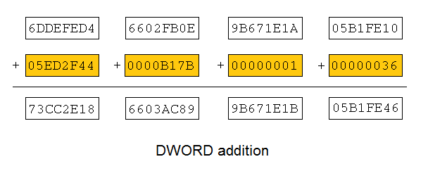
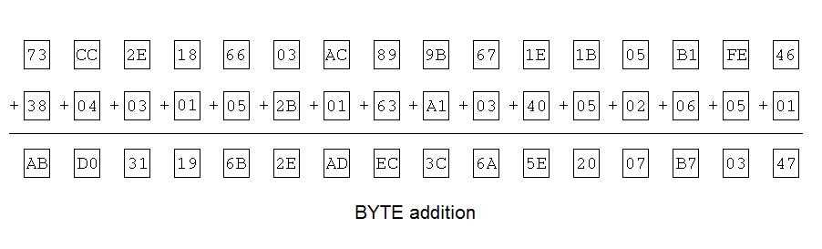

# Round 3: Running Numbers

## Problem description

Write code that receives an input in the size of 16 BYTEs and runs until all bytes are zero or repeat the original input bytes. Every cycle of the program a value is added to each BYTE separately. Every 37th cycle, the buffer is converted to four DWORDs and a value is added to each DWORD separately. For 38th cycle, the DWORD is converted back to 16 BYTEs and the addition process repeats (another 37 cycles each). Since addition of fixed size values is cyclic itself, after enough iterations through this process, the value of the array will either repeat the initial values or each becomes zero. The goal of your code is to compute the number of cycles required to reach all zero values simultaneously or detect the repetition of the original input values.

## Correction

Simulation begins on cycle number 0. There's a DWORD add on cycle 0 and again whenever cycle % 37 == 0. Output the number of cycles where cycle number 0 counts as the first one.

## Input Description

The input is passed to the program as three command line arguments each is a collection of hex digits. The arguments are separated by space. The first argument is the Source buffer to which data is added. The second argument is the BYTE Addition value which is the value to add to the Source buffer as byte every cycle. The third argument is the DWORD Addition value which is the value to add to the Source buffer every 37th cycle.

## Output description

The program only need to write the number of cycles it took until the Source buffer reached the value of zero in all bytes or repeats the input digits.

## Key files in this directory

* [**Rick LaMont's original submission**](main.cpp) placed first.
* [**A reference implementation**](classic.cpp) of a reliable O(n) solution that also uses threading and SSE. Rick used this to verify the correctness of his actual submission.

## Notes on scoring

Full scoring was as follows:
* 100 points for submitting an entry
* 25 points for posting 5 or more comments in the contest forums
* 11.11 points on each of nine test cases for having the fastest correct program. Some consolation points were awarded for correct, non-first place entries.

Rick LaMont scored 206.22 points with the fastest correct program on seven of the nine test cases.

---

## Rick LaMont's post-mortem of Barrel Lock, posted on Intel's contest forum 2011

When I first read the Running Numbers problem description, it screamed "SSE". Meanwhile, the 37 cycle pattern whispered, "You have 40 cores. Use 37 threads to decompose it."

Yet SSE and threading will only go so far when the basic algorithm is "grind it out". In order to go really fast one needs to optimze the algorithm.

**BASIC CONCEPTS**

Define "block" as a set of 37 cycles, beginning with the DWORD addition and ending after the 36th BYTE addition.



Define "bucket" as each of the 37 positions within a block. Bucket number 0 represents any state that occurs immediately after a DWORD addition. Bucket number 36 falls at the end of a block, after the 36th BYTE addition and immediately before the DWORD addition that will begin the next block.

Consider the sample problem where the solution is 574,395,734.
```
    574395734 / 37 = 15524209 blocks
    574395734 % 37 = 1 cycle
```
More precisely, a solution was found in bucket 0 after 15,524,209 blocks. Note that the "off by one" is due to the first cycle being cycle number 0. Bucket 0 represents the state after 1 cycle, 38 cycles, 75 cycles, etc.

**THREADING MODEL**

Deompose the problem into 74 jobs. The first bank of 37 jobs seeks solutions where all bytes reach zero simultaneously. Each job focuses only on one bucket: job 0 takes bucket 0, job 1 takes bucket 1, and so on. Jobs 38 through 73 seek solutions where the bytes repeat their initial values, again with one job per bucket.

Separating "zero" jobs from "repeat" jobs simplifies the problem. While it's possible that the same bucket will have both types of solutions, those two searches will lead in different directions (unless the initial values were all zeros).

Ideally, there would be 74 cores to run all 74 jobs simultaneously. In practice on the MTL there are 40 or fewer cores. Create a thread pool with the number of threads equal to the number of cores. Assign jobs to threads through a simple work queue.

Each job will initially start at its given bucket within block number zero.  After that it will advance one or more blocks at a time until it finds its goal state (zero/repeat) or determines that the goal state cannot be reached in this bucket.

Let "front" be the cumulative BYTE step from the beginning of the block to this bucket:
```
    front = bucket * BYTEadder (8 bit multiply)
```
Let "back" be the step from this bucket to the end of the block:
```
    back = (36 - bucket) * BYTEadder (8 bit multiply)
```
When a job needs to advance the accumulator "acc" by one block it takes these steps:


```
    acc += back                 // 8 bit addition
    acc += DWORDadder           // 32 bit addition
    acc += front                // 8 bit addition
```
Suppose a thread knows that there is no solution at its bucket in the next block. It can advance two blocks like this:


```
    acc += back                 // 8 bit addition
    acc += DWORDadder           // 32 bit addition
    acc += 36 * BYTEadder
    acc += DWORDadder
    acc += front
```
The intervening block is said to have been "skimmed" because no particular bucket was visited there. This concept can be generalized to advance by n blocks, skimming over n-1 blocks:
```
    acc += back
    acc += DWORDadder
    for i = 1 to n-1
        acc += 36 * BYTEadder
        acc += DWORDadder
    acc += front
```
This takes 2n + 1 instructions to advance by n blocks (i.e. 37n cycles). Here is the actual C++ code for a function to skim n blocks. It uses SSE instructions in an unrolled loop.
```
inline __m128i skim(int count, __m128i a,
    __m128i front, __m128i back, __m128i b)
{
    //
    // Finish current block and do DWORD step to start next one
    //
    a = _mm_add_epi32(_mm_add_epi8(a, back), gDwordAdder);

    //
    // Quickly skim over count-1 whole blocks. Do not use front/back
    // steps to visit any particular bucket along the way.
    //
    register int n = (--count + 31) / 32;
    switch (count & 31)
        while (--n > 0) {
             a = _mm_add_epi32(_mm_add_epi8(a, b), gDwordAdder);
    case 31: a = _mm_add_epi32(_mm_add_epi8(a, b), gDwordAdder);
    case 30: a = _mm_add_epi32(_mm_add_epi8(a, b), gDwordAdder);
    case 29: a = _mm_add_epi32(_mm_add_epi8(a, b), gDwordAdder);
    case 28: a = _mm_add_epi32(_mm_add_epi8(a, b), gDwordAdder);
    case 27: a = _mm_add_epi32(_mm_add_epi8(a, b), gDwordAdder);
    case 26: a = _mm_add_epi32(_mm_add_epi8(a, b), gDwordAdder);
    case 25: a = _mm_add_epi32(_mm_add_epi8(a, b), gDwordAdder);
    case 24: a = _mm_add_epi32(_mm_add_epi8(a, b), gDwordAdder);
    case 23: a = _mm_add_epi32(_mm_add_epi8(a, b), gDwordAdder);
    case 22: a = _mm_add_epi32(_mm_add_epi8(a, b), gDwordAdder);
    case 21: a = _mm_add_epi32(_mm_add_epi8(a, b), gDwordAdder);
    case 20: a = _mm_add_epi32(_mm_add_epi8(a, b), gDwordAdder);
    case 19: a = _mm_add_epi32(_mm_add_epi8(a, b), gDwordAdder);
    case 18: a = _mm_add_epi32(_mm_add_epi8(a, b), gDwordAdder);
    case 17: a = _mm_add_epi32(_mm_add_epi8(a, b), gDwordAdder);
    case 16: a = _mm_add_epi32(_mm_add_epi8(a, b), gDwordAdder);
    case 15: a = _mm_add_epi32(_mm_add_epi8(a, b), gDwordAdder);
    case 14: a = _mm_add_epi32(_mm_add_epi8(a, b), gDwordAdder);
    case 13: a = _mm_add_epi32(_mm_add_epi8(a, b), gDwordAdder);
    case 12: a = _mm_add_epi32(_mm_add_epi8(a, b), gDwordAdder);
    case 11: a = _mm_add_epi32(_mm_add_epi8(a, b), gDwordAdder);
    case 10: a = _mm_add_epi32(_mm_add_epi8(a, b), gDwordAdder);
    case  9: a = _mm_add_epi32(_mm_add_epi8(a, b), gDwordAdder);
    case  8: a = _mm_add_epi32(_mm_add_epi8(a, b), gDwordAdder);
    case  7: a = _mm_add_epi32(_mm_add_epi8(a, b), gDwordAdder);
    case  6: a = _mm_add_epi32(_mm_add_epi8(a, b), gDwordAdder);
    case  5: a = _mm_add_epi32(_mm_add_epi8(a, b), gDwordAdder);
    case  4: a = _mm_add_epi32(_mm_add_epi8(a, b), gDwordAdder);
    case  3: a = _mm_add_epi32(_mm_add_epi8(a, b), gDwordAdder);
    case  2: a = _mm_add_epi32(_mm_add_epi8(a, b), gDwordAdder);
    case  1: a = _mm_add_epi32(_mm_add_epi8(a, b), gDwordAdder);
    case  0: ;
        }

    //
    // Half a block back to home bucket.
    //
    return _mm_add_epi8(a, front);
}
```
**BARREL LOCK**

I call this algorithm "barrel lock" because it's analogous to opening a 4 dial lock when you already know the combination.



Partition the 128 bit accumulator into four logical dials each indicated by a color in this diagram:


Each dial consists of 4 non-contiguous bytes. The red dial is made up of the least significant byte of each DWORD, while the yellow dial is the most significant bytes. A dial is not considered solved until all four bytes have their target values.

The algorithm works in four phases from right to left. The first phase gets the red dial into position. The second phase works on the green dial without moving the red dial, and so on.

For example consider the test where:
```
    SOURCE     = d6b610c012e049601632f70094c145c0
    BYTEadder  = 1bbffa833f0e0f733ca510f5044ef24a
    DWORDadder = 39499f0b48e0f3ec3cca214b7a1e0474
```
The solution proceeds as follows:
```
                        accumulator                             ncycles
    initially:          d6b610c0 12e04960 1632f700 94c145c0                  0
    after red phase:    71f37400 087a6000 5adf7400 df42b000              3,520
    after green phase:  cf4f0000 aac80000 cd8f0000 18e40000            344,512
    after blue phase:   f8000000 40000000 f8000000 20000000        434,389,440
    after yellow phase: 00000000 00000000 00000000 00000000     15,332,557,248
```
The dials on an actual barrel lock are independent. Once a dial is in place you don't have to move it again. However, the Running Numbers problem more closely resembles an odometer than a barrel lock. The green dial doesn't advance without the red dial also advancing.

The basic concept to make this odometer act like a barrel lock is to figure out the "period" of each dial - the minimum number of blocks for it to return to its current stage. The typical period for the red dial (with 94% probability) is 256. For now, assume that all four periods have their typical values:
```
    redPeriod    = 2^8
    greenPeriod  = 2^16
    bluePeriod   = 2^24
    yellowPeriod = 2^32
```
Suppose the red dial is already in its target position of all bytes zero. The green phase of the algorithm can now safely advance 256 blocks at a time using `skim(256)` because that is the next time that the red dial will be in its target position. All intervening blocks are non-solutions because the red dial will be out of position. This is how the green phase works:
```
    delta = redPeriod * 37              // cycles per skim
    n = greenPeriod / redPeriod         // up to 256 iterations this phase
    while n-- > 0
        if green dial of acc is in target position
            proceed to blue phase
        acc = skim(redPeriod)
        ncycles += delta
    report no solution found for this job
```
The blue phase nearly identical except it skims bigger chunks, up to 65,536 blocks at a time:
```
    delta = greenPeriod * 37
    n = bluePeriod / greenPeriod
    while n-- > 0
        if blue dial of acc is in target position
            proceed to blue phase
        acc = skim(greenPeriod)
        ncycles += delta
    report no solution found for this job
```
To put things in perspective, note that some of the other post-mortems describe checks that allow the next 36 cycles to be skipped. The skim within the blue phase is skipping up to 2,424,832 cycles (65,536 * 37) without checking for a solution.

Things get interesting in the yellow (final) phase. It could just call `skim(bluePeriod)` like the other phases did but that's no longer necessary.  The red, green and blue dials are already in place. The only dial still turning is the yellow one and it doesn't matter how many carries it generates into the bit bucket. What matters is how far the yellow dial turns for each bluePeriod. This is a constant that I calculate during initialization while figuring out the periods (hint: it's often equal to the least significant byte of each DWORD in DWORDadder.)

Armed with this magic blueCarry constant, the yellow phase is simply:
```
    delta = bluePeriod
    n = yellowPeriod / bluePeriod
    while n-- > 0
        if yellow dial of acc is in target position
            report solution found at ncycles
        acc += blueCarry                // much faster than skimming
        ncycles += delta
    report no solution found for this job
```
Now lets go back and examine the red (first) phase. It can take advantage of the fact that no carries will be coming in from below. Essentially it uses a "miniature barrel lock" algorithm with 8 dials, one for each bit.  It dials them in one at a time from right to left:
```
    delta = CYCLES_PER_BLOCK
    for b = 0 to 7                      // iterate over eight bits of red dial
        if any bit b of acc is not in target state
            acc = skim(2 ^ b)
            cycles += delta
            delta *= 2
    if all bits of red dial are in target position
        proceed to green phase
    else
        report no solution found for this job
```
That's the barrel lock algorithm in a nutshell. Four phases to solve four dials.

**INITIALIZING BARREL LOCK**

All that's left now is to initialize the four periods (they're not always powers of 256) and the blueCarry. This initialization depends upon the command line inputs but is common to all jobs so it is done prior to starting the threads.

Barrel lock is one of those algorithms where the initialization is more complicated than the main loop. I'm not going to cover all of the details such as the special case where redPeriod = 1. The executive summary is that it's initialized with linear code based on modular arithmetic that I worked out on paper. There are no loops or big lookup tables.

Define "block adder" as (DWORDadder + 36 * BYTEadder). Examine each DWORD of block adder and count the number of zero bits each ends with.  For example, 0x91544B9C ends with two zero bits because 0xC is 1100 in binary.  Let z0 = the number of trailing zeros in DWORD 0 of block adder, z1 for DWORD 1, and so on. If the minimum of (z0, z1, z2, z3) is 0, then redPeriod = 256. If the minimum is 1, redPeriod = 128. In general:
```
    redPeriod = 2 ^ (8 - min(z0, z1, z2, z3))
```
Over the course of redPeriod blocks, how many carries will there be from the red bytes to the green bytes? It's usually just the low byte of each DWORD in DWORDadder. However, set bits in DWORDadder that are lower than bit z0 (or z1,z2,z3) have already been canceled out by the bits of 36 * BYTEadder, resulting in a 0 bit in the block step. Otherwise z0 would have indicated this 1 bit. Build a bitmask from the z's:
```
    zmask = {2^z3 - 1, 2^z2 - 1, 2^z1 - 1, 2^z0 - 1}
```
The carry from red to green is then given by:
```
    redCarry = ((SOURCE & zmask) + DWORDadder) & ~zmask
```
Where SOURCE is the initial state given on the command-line.

Turn around and count the zero bits in each DWORD of redCarry, just like before. Let zcarry equal the minimum of these four values. Now we can calculate the other periods and blueCarry as:
```
    greenPeriod  = 2 ^ (16 - zcarry);
    bluePeriod   = 2 ^ (24 - zcarry);
    yellowPeriod = 2 ^ (32 - zcarry);
    blueCarry    = redCarry * bluePeriod;
```
**RUNTIME ANALYSIS**

Define "probe" as any comparison between the accumulator and a full or partial goal state. A naive algorithm alternates between steps and probes:
```
    advance one cycle
    is this a solution?
    advance one cycle
    is this a solution?
```
Probes are more expensive than steps, not becuase they use more instructions but because of the inherent branching. Barrel lock seeks to minimize probes. In the worst case a job would need:
```
    red phase:      9 probes
    green phase:  256 probes
    blue phase:   256 probes
    yellow phase: 256 probes
    total:        777 probes
```
Here is the table of worst case steps for a job in terms of the number of SSE instructions (i.e. skimming n blocks takes 2n+1 steps):
```
    red phase:           518 steps
    green phase:     131,328 steps
    blue phase:   33,554,688 steps
    yellow phase:        256 steps
    total:        33,686,790 steps
```
The blue phase is the bottleneck due to the cost of skimming 64K blocks at a time. Therefore, the barrel lock algorithm is O(n) where:
```
    n = (ncycles / (37 * greenPeriod)) % 256
```
In a typical test with an "all bytes zero" solution, only two jobs will make it beyond the red phase. The other 72 jobs fail to launch, freeing up threads to work on other jobs.

The two jobs that do launch are the one that ultimately finds the solution and job #73. You see, job 73 is the one that finds the inevitable repeat after 37 * yellowPeriod cycles. Unfortunately, it needs to take the maximum number of probes (776) to find it. My program includes a special early exit for job 73 if it appears to be bound for the maximum cycles.

**PERFORMANCE**

Here are my benchmarks on the Linux MTL batch node acano02 using the usual test suite:
```
          4,774 cycles:          1.039 milliseconds
          7,196 cycles:          1.027
         21,593 cycles:          1.047
          7,179 cycles:          1.026
          5,039 cycles:          1.038
         11,419 cycles:          1.038
    431,787,735 cycles:          3.818
    574,395,734 cycles:         14.276
  1,241,513,984 cycles:          1.051
  1,483,695,460 cycles:          6.456
  2,626,626,062 cycles:          4.233
  4,076,988,879 cycles:          9.285
 15,332,557,248 cycles:         10.994
 79,456,894,940 cycles:         11.952
```
Three of these tests are noteworthy. The 21,593 cycles test has a redPeriod of 128. All the rest have the typical 256 redPeriod. On the last test (lazydodo's repeat example) all 37 repeat jobs make it to the yellow phase and find solutions. That's when it's nice to have 40 cores. Finally, the sample 574,395,734 cycle test is a near worst-case scenario for barrel lock because it has a heavy blue phase: 237 (out of a possible 256) probes along with the maximum greenPeriod of 64K.

The worst case (max probes, max steps) breakdown for each phase of a job are:
```
    red phase:        1 microseconds
    green phase:     64 microseconds
    blue phase:  14,878 microseconds
    yellow phase:     1 microseconds
    total:       14,944 microseconds
```
The bottom line is that this program solves any problem in about 15 milliseconds or less.  I'm pleased with this result but believe there's room for improvement. With sufficient modular arithmetic analysis, it may be possible to optimize the green and blue phases in a fashion similar to that of the yellow phase.

**SOURCE CODE**

Below is the complete source code as submitted for the contest. It's just
one file (463 source lines of code plus heavy commenting) so I didn't
bother to zip it.

[Original submission](main.cpp)

## Historical Commentary

> The following commentary is sourced from my contemporaneous developer's blog in 2011. While some of the language reflects the competitive "heat of the moment" and the excitement of my followers at the time, please view it through a historical lens. I have the utmost respect for the brilliant engineers who competed alongside me. The Intel Threading Challenge was a high-water mark for manycore optimization and I am honored to have been a part of it.

**6/14/11:**
The third round has started and nobody stands a chance against my awesome program. It's another math problem that I've figured out to a greater degree than the problem designers imagined.

This will be the final round before they award the grand prize. Winning 2 out of 3 rounds would guarantee that Intel pays for my vacation this autumn.

My programming contest is over for now. Round 3 of 3 closed this week. Now we have to wait for the judges to score rounds 2 and 3 to see if I will win the Grand Prize - a trip to San Francisco.

Round 3 was definitely my strongest. I expect my program to dominate the competition on any test the judges throw at it. Some of my competitors published their execution times on a set of benchmark tests we were all using. Here's how my program stacks up against theirs (all times in milliseconds, lower numbers are better):

| Problem size (in cycles) | Competitor A (in msecs) | Competitor B (in msecs) | Competitor C (in msecs) | Rick LaMont (in msecs) |
| ---: | ---: | ---: | ---: | ---: |
| 4,774 | N/A | 1.751 | 2.977 | 1.039 |
| 7,196 | 2.444 | N/A | 2.820 | 1.027 |
| 7,179 | 2.205 | N/A | 3.132 | 1.026 |
| 5,039 | 2.584 | N/A | 2.918 | 1.038 |
| 11,419 | 1.688 | N/A | 2.798 | 1.038 |
| 21,593 | 1.695 | N/A | 2.933 | 1.047 |
| 431,787,735 | 43.513 | 50.529 | 23.632 | 3.818 |
| 574,395,734 | 33.885 | 59.513 | 30.731 | 14.276 |
| 1,241,513,984 | 60.255 | N/A | N/A | 1.051 |
| 1,483,695,460 | 66.790 | 152.44 | 77.065 | 6.456 |
| 2,626,626,062 | 102.318 | 268.011 | 135.417 | 4.233 |
| 4,076,988,879 | 144.773 | 411.186 | 190.577 | 9.285 |
| 15,332,557,248 | 434.253 | 1,517.950 | 592.374 | 10.994 |
| 79,456,894,940 | 1,955.989 | 7,836.130 | 890.413 | 11.952 |
| 158,913,789,952 | 3,892.730 | N/A | 1,623.424 | N/A |

*(Competitor B claims to have doubled this speed prior to submitting his entry.)*

Note how the other programs get progressively slower as the problem size grows. That's called linear or O(n) running time. My program solves any problem in 15 milliseconds or less. The 574,395,734 test is a near worst-case scenario for it.

Now I will go into some detail about the problem statement and my solution. This will get technical but at least there are pretty pictures...

The problem is called Running Numbers because it acts like a crazy odometer. Given three 128 bit input values (in hexadecimal):



Create an accumulator that starts with value Source. On the first cycle (cycle number zero), add DWORD adder to the accumulator. For this addition treat both the accumulator and the adder as four independent 32-bit words. If the result of any addition exceeds the 32-bit capacity it simply "rolls over", discarding the carry:



For the second cycle (number 1), add BYTE adder to the accumulator. This time the accumulator and adder will be treated as 16 individual bytes, each rolling over without carry:



Continue doing BYTE additions for 35 more cycles. On the 37th cycle (cycle number 36), the whole process starts over with a DWORD addition. In other words, do a DWORD addition whenever the cycle number is evenly divisible by 37. Otherwise, do a BYTE addition. Run this simulation until a cycle ends with all bytes equal to zero or all bytes equal Source (their original values). When that happens, print the number of cycles completed and exit.

Here's pseudocode for the simulation:
```
    a = Source
    cycle = 0
    do
        if cycle % 37 == 0
            a = a + DWORD adder
        else
            a = a + BYTE adder
        cycle = cycle + 1
    while a != 0 AND a != Source
    print cycle
```
So there's my winning solution. I think it's elegant in its simplicity. Just kidding!

When I read the problem description, it screamed "Streaming SIMD Extentions" (SSE):
```
Q. 128 bit integer registers?
A. SSE2
Q. Add as four DWORDS?
A. PADDD (_mm_add_epi32 intrinsic)
Q. Add as sixteen BYTES?
A. PADDB (_mm_add_epi8 intrinsic)
```
Meanwhile, the 37 cycle pattern whispered, "You have 40 cores. Use 37 threads to decompose it." Yet SSE and threading will only go so far when your basic algorithm is "grind it out". In order to go really fast one needs to optimize the algorithm.

I named my algorithm barrel lock because it's analogous to opening a 4 dial lock when you already know the combination.


Partition the 128 bit accumulator into four logical dials as indicated by the four colors in this diagram:


Each dial consists of 4 non-contiguous bytes. The red dial is made up of the least significant byte of each DWORD while the yellow dial is the set of most significant bytes. A dial is not considered solved until all four bytes reach their target values.

The algorithm works in four phases from right to left. The first phase gets the red dial into position. The second phase works on the green dial without moving the red dial, and so on.

For example consider a test where:
```
Source = d6b610c012e049601632f70094c145c0
BYTE adder = 1bbffa833f0e0f733ca510f5044ef24a
DWORD adder = 39499f0b48e0f3ec3cca214b7a1e0474
```
The solution proceeds as follows:

| After phase | Accumulator | Number of cycles |
| :--- | :---: | ---: |
| initial | d6b610c0 12e04960 1632f700 94c145c0 | 0 |
| red | 71f37400 087a6000 5adf7400 df42b000 | 3,520 |
| green | cf4f0000 aac80000 cd8f0000 18e40000 | 344,512 |
| blue | f8000000 40000000 f8000000 20000000 | 434,389,440 |
| yellow | 00000000 00000000 00000000 00000000 | 15,332,557,248 |

That should give you a flavor for how I solved this problem.

**8/18/2011:**
The programming contest is over. I won round 3 and the grand prize! A perfect score for the third round would have been 225 points. I scored 206.22 which is good, but not the total domination I expected. The second place finisher scored 161.48 points.

Here's the breakdown of my score:

* 100 points for submitting an entry
* 25 points for posting 5 or more comments in the contest forums
* 81.22 points for having the fastest correct program on 7 of the 9 test cases

The first two test cases must have been really small. My program solved each of them in 4 milliseconds and only came in 6th or 7th place on those tests. Some other programs are said to have solved them in 0.000 milliseconds (less than 500 microseconds?) Once we got into the real tests, however, my program took over. On one large test my program finished in 24 milliseconds, almost 25 times faster than the second place finisher at 582 milliseconds.

For the grand prize scoring, they normalized the three rounds to be worth 100 points each. A perfect score would have been 300 for winning all three rounds. Here's the final tally:

* 284.2822 - Rick LaMont
* 242.1222 - first runner up
* 239.6088 - second runner up

So I'm off to San Francisco next month!
